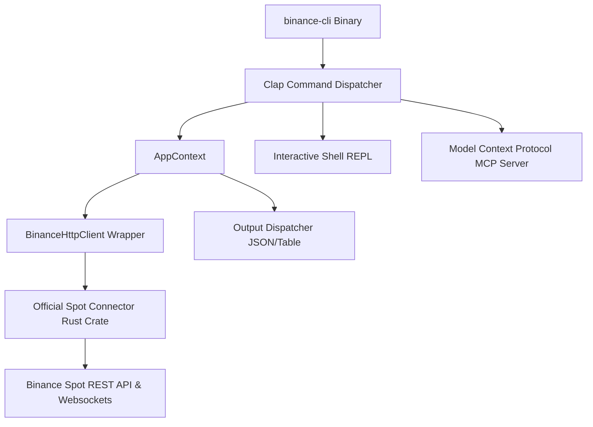

# ⚡ Unofficial Binance Spot CLI in Rust ⚡

[](https://www.rust-lang.org)
[](LICENSE)
[](https://developers.binance.com)

A high-performance, beautiful, and modular Command-Line Interface (CLI) for the Binance Spot exchange, built with Rust. This tool replicates the premium architecture of bittime-cli, indodax-cli, and kraken-cli, offering visual console tables, real-time WebSocket streams, a secure config system, a stateful REPL interactive shell, and Model Context Protocol (MCP) server support for AI orchestrations.

```
╔══════════════════════════════════════════╗
║        Binance Interactive Shell         ║
║  Type commands without 'binance' prefix  ║
║  Type 'help' or 'exit' to quit           ║
╚══════════════════════════════════════════╝

binance> market price BTCUSDT
Price — BTCUSDT
+--------+----------------+
| Field  | Value          |
+=========================+
| price  | 78086.61000000 |
|--------+----------------|
| symbol | BTCUSDT        |
+--------+----------------+
```

---

## ✨ Features

*   **⚡ High Performance**: Written in pure Rust with asynchronous token pipelines powered by `tokio` and `hyper`.
*   **🎨 Premium Typography & Tables**: Auto-renders JSON structures into beautiful console tables with responsive layout systems and curated color rules (e.g. ASK = 🔴, BID = 🟢, Tickers = 🟡).
*   **🛠️ Robust Config Manager**: Secure credentials storage at `~/.config/binance/config.toml` (restricted to `0600` permissions) supporting priority overrides: CLI arguments > Environment variables > config.toml.
*   **🔄 Fully Stateful REPL Shell**: Runs an embedded readline shell with tab history preservation (`~/.config/binance/history`) and clean error isolation.
*   **📡 Smart WebSocket Streams**: Real-time ticker order book stream depth, and secure private user streams with a background thread executing automatic keep-alive `PUT` requests every 30 minutes.
*   **🤖 Model Context Protocol (MCP)**: Directly exposes CLI clap parameters into AI tools, converting arguments dynamically to JSON-schema for seamless LLM orchestrations.
*   **📉 Virtual Paper Trading**: Built-in mock portfolio balance tracker (`USDT`, `BTC`, `BNB`) for safe local CLI validation.

---

## 🛠️ Architecture Overview



---

## 🚀 Installation & Build

Ensure you have Rust and Cargo installed. Then, clone the repository and build the workspace:

```bash
# Clone the repository
git clone /root/binance-cli
cd binance-cli

# Build in release mode
cargo build --release

# Run checks or tests
cargo check
cargo test
```

The compiled binary will be available at `target/release/binance`.

---

## 🔑 Authentication Config Setup

Initialize your credentials securely:

```bash
# Set credentials interactively or directly
binance auth set --api-key YOUR_API_KEY --api-secret YOUR_API_SECRET

# Verify your credentials connection
binance auth test

# Show current credential metadata
binance auth show
```

The config will be securely stored under `~/.config/binance/config.toml`.

---

## 📖 Command Guide

### 1. Market Data (Public endpoints)
```bash
# Ping the Binance REST API
binance market ping

# Check UTC Server Timestamp
binance market server-time

# Fetch Symbol Price
binance market price BTCUSDT

# Check 24-Hour Change Ticker
binance market ticker BTCUSDT

# Get Order Book Depth
binance market orderbook BTCUSDT --limit 20

# View Recent Candlestick Klines
binance market klines BTCUSDT --interval 5m --limit 50
```

### 2. Trading Operations (Private endpoints)
```bash
# Place a LIMIT BUY Order (Price & Qty)
binance trade buy BTCUSDT --quantity 0.005 --price 76500

# Place a MARKET SELL Order (Qty only)
binance trade sell BTCUSDT --type MARKET --quantity 0.002

# List Open Orders
binance trade open-orders --symbol BTCUSDT

# Cancel an Order
binance trade cancel BTCUSDT --order-id 1872651

# Cancel all open orders for a symbol
binance trade cancel-all BTCUSDT
```

### 3. Funding & Balances
```bash
# Get non-zero account balances
binance account balance

# Request Deposit Address
binance funding deposit-address --coin BTC

# Withdraw Assets
binance funding withdraw --coin USDT --amount 100 --address destination_wallet_address
```

### 4. WebSocket Streaming
```bash
# Stream Order Book Depth updates
binance ws depth BTCUSDT

# Stream Real-time 24h Ticker updates
binance ws ticker BTCUSDT

# Stream Real-time Best Bid/Ask Book Ticker updates
binance ws book-ticker BTCUSDT

# Stream User Data updates (balances, order executions)
binance ws user
```

### 5. Interactive REPL Shell
```bash
# Start interactive shell
binance shell
```

---

## 🤖 Model Context Protocol (MCP) Integration

This CLI includes a native Model Context Protocol stdio server to connect it directly to AI tools (such as Claude Desktop, Cursor, or Trae).

To register `binance-cli` to your MCP client config, add:

```json
{
  "mcpServers": {
    "binance-cli": {
      "command": "/root/binance-cli/target/release/binance",
      "args": ["mcp"],
      "env": {
        "BINANCE_API_KEY": "your_api_key_here",
        "BINANCE_API_SECRET": "your_api_secret_here"
      }
    }
  }
}
```

The MCP engine dynamically parses the clap CLI command structure, auto-registers schemas, and routes execution calls safely, formatting standard JSON responses directly back to the LLM.

---

## 📝 License

Distributed under the MIT License. See [LICENSE](LICENSE) for more information.

---

*Made with 🦀 and 💖 for premium CLI experiences.*
